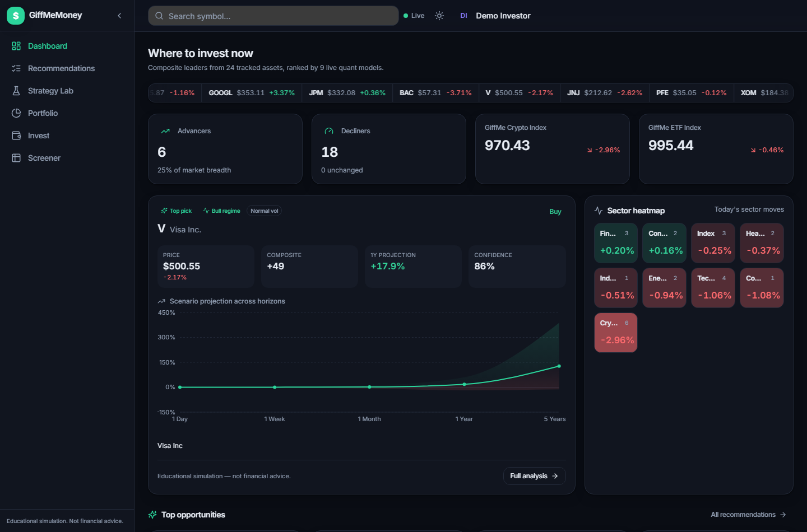
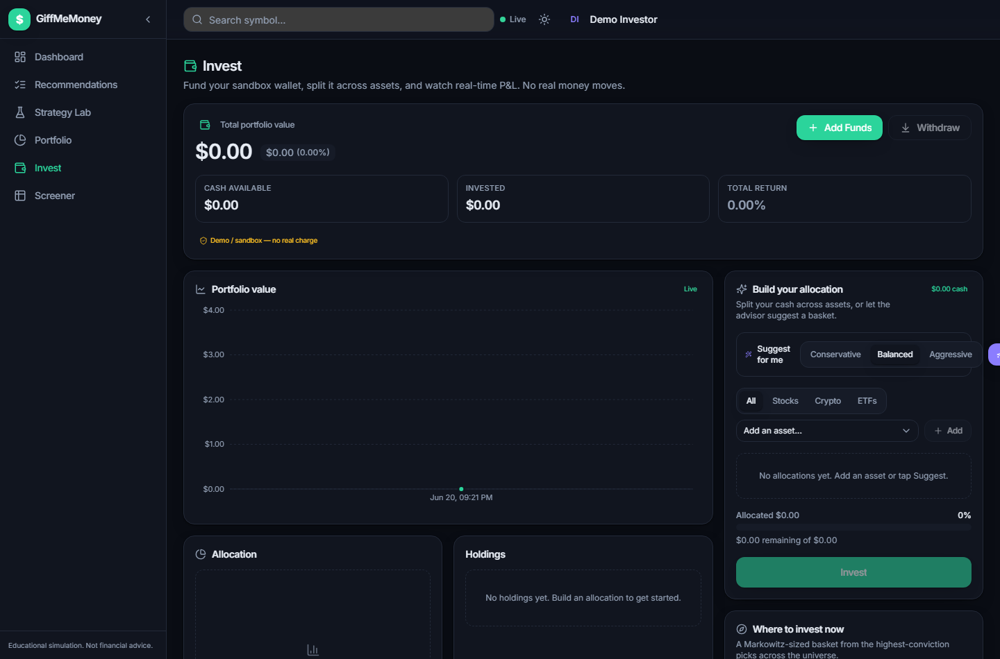
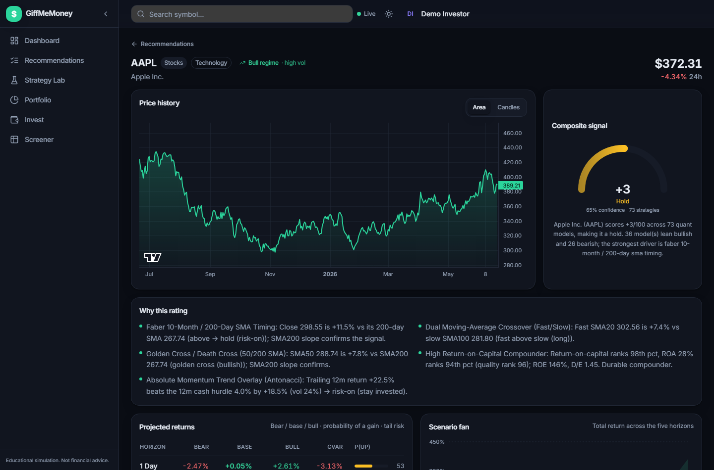
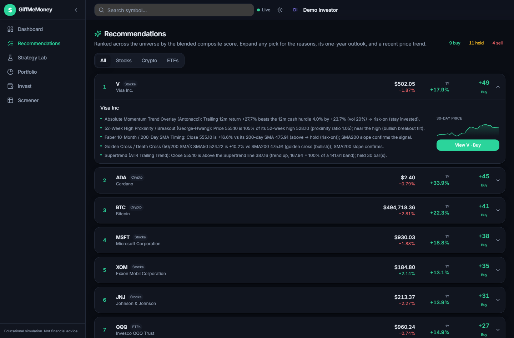
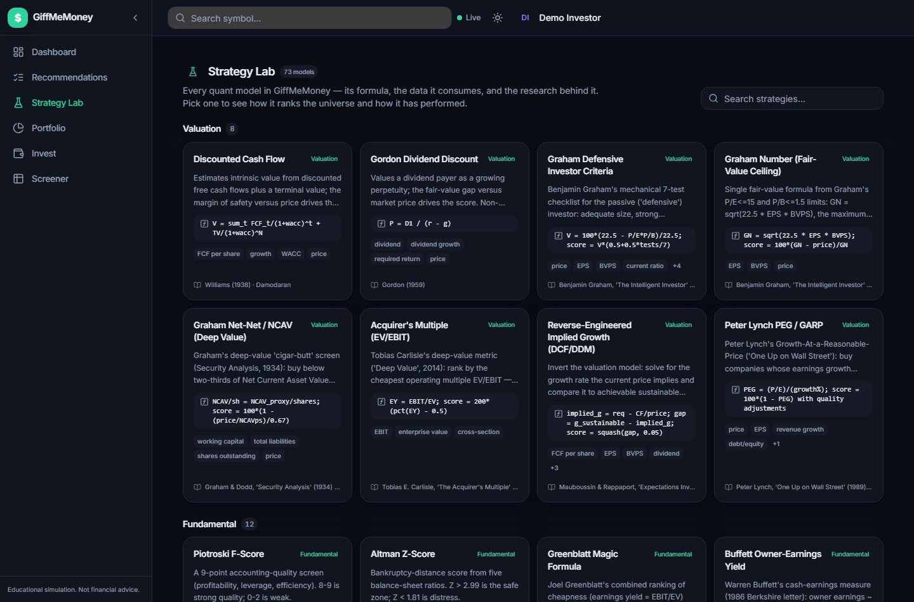
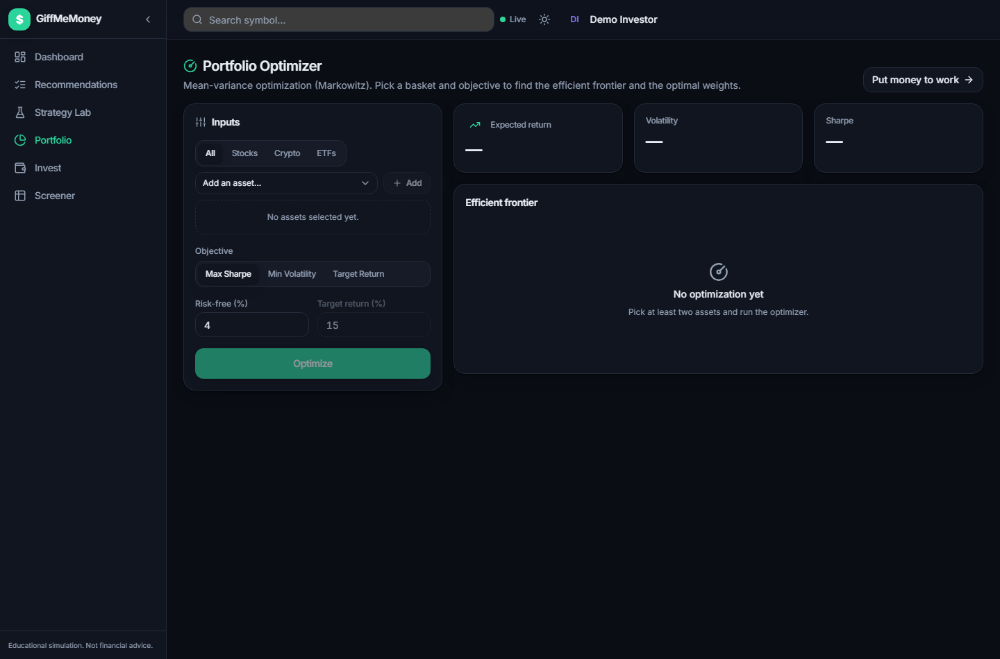
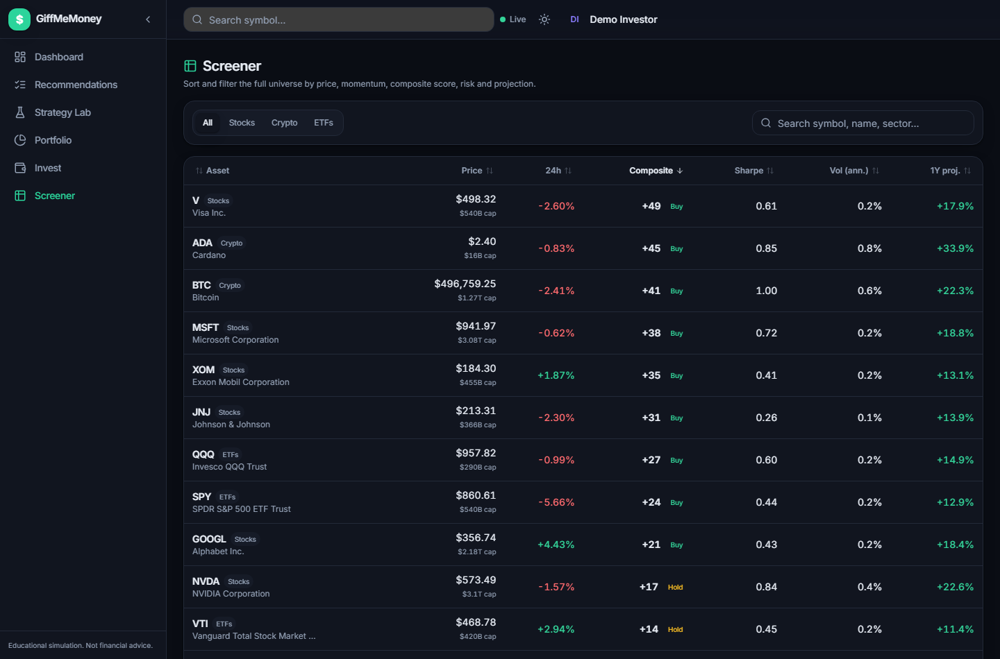

# GiffMeMoney

> **An intelligent, quant-backed investment advisor that tells you _where_ to invest and _why_ — and lets you act on it in a real-time simulated brokerage.**

GiffMeMoney runs **73 named quantitative finance models** over every asset in its universe, blends
them into a single composite recommendation with a plain-English rationale, and projects expected
returns across **five horizons (1 Day → 5 Years)** with credible confidence bands, bull/base/bear
scenarios, and tail-risk (CVaR). You can then fund a sandbox wallet, split money across a
data-driven basket, and watch live per-position P&L — all on a deterministic market simulator that
runs end-to-end with **no API keys**.

> ⚠️ **Educational simulation — not financial advice. No real money ever moves.** See the
> [Disclaimer](#disclaimer) before anything else.

---

## What it is / who it helps

GiffMeMoney is a full-stack web app: a **React** front end talking to a **FastAPI** quant engine.
It is built for people who want to understand *the reasoning behind an investment call* — students,
hobbyist quants, and builders evaluating finance tooling — not just a number on a screen. Every
recommendation shows the models that produced it, their formulas, their realized backtest
performance, and an honest downside.

The whole platform runs on a built-in **deterministic market simulator** (synthetic multi-year
OHLCV history + live ticks for 24 assets across equities, crypto, and ETFs), so you can clone it
and have the complete experience working in minutes without signing up for any data vendor.

---

## Features

### The quant engine — 73 strategies in 8 families

For each asset the engine evaluates all 73 strategies (each emits a score in `-100..100`, a
confidence, a formula, raw metrics, and a plain-English rationale), then combines them into a
**reliability-weighted composite** with a calibrated `STRONG_BUY → STRONG_SELL` stance. The
registry spans the 20 core models plus 53 cited, literature-backed strategies:

| Family | Count | Examples |
|---|---:|---|
| **Technical** | 25 | MACD, RSI(14), Bollinger %B, Supertrend, Ichimoku, ADX trend, Donchian/Turtle, Keltner, Stochastic, Williams %R, CCI, OBV, golden-cross, MA-ribbon |
| **Fundamental** | 12 | Piotroski F-Score, Altman Z-Score, Graham defensive/number, Net-Net (NCAV), dividend safety/growth, shareholder yield, Chowder rule |
| **Valuation** | 8 | DCF intrinsic value, Gordon DDM, Magic Formula, Acquirer's Multiple, owner-earnings yield, reverse-implied-growth, PEG/Lynch |
| **Statistical** | 8 | Monte Carlo (GBM), GARCH(1,1) regime, OLS trend + Holt-Winters, OU z-score mean reversion, pairs trading, seasonality |
| **Factor** | 7 | CAPM, Fama–French 3- & 5-factor, QMJ (quality-minus-junk), gross profitability, betting-against-beta, low-vol anomaly |
| **Portfolio** | 7 | Markowitz mean-variance fit, risk parity, inverse-vol, min-variance, all-weather, permanent portfolio, vol-target |
| **Risk-Adjusted** | 5 | Sharpe, Sortino, VaR/CVaR, Kelly criterion, 12-1 momentum |
| **Derivatives** | 1 | Black–Scholes price + greeks + implied vol |

All math is implemented **from scratch on numpy / scipy / pandas** — no `statsmodels`, `arch`, or
`sklearn`. GARCH MLE, Holt-Winters, OLS, and the Markowitz optimizer are hand-rolled, so the
formulas are real and the dependency surface stays small.

### Credible 5-horizon projections + scenarios + rigor

A single unified projection engine (`quant/projection.py`) drives **both** the blended
`expectedReturns` and the Monte-Carlo endpoint, so the numbers agree. For each of the 5 horizons
(**1D / 1W / 1M / 1Y / 5Y**) it produces an expected return, fat-tailed (Student-t / bootstrap)
confidence band, probability of profit, **bull / base / bear** scenario fan, and **CVaR** expected
shortfall. It was hardened against a live over-optimism audit (the **R1–R8** rigor rules):

- **R1** Ensemble drift shrunk James–Stein-style toward a CAPM prior, with realistic annualized caps (no +800% projections).
- **R2** Believable bands floored/capped to credible bounds; CAGR shown alongside multi-year totals.
- **R3** One projection engine → `/analysis` and `/montecarlo` agree on 1Y to ~1pp.
- **R4** Confidence spreads across ~`[0.2, 0.9]`, driven by signal consensus, data quality, strategy reliability, and regime clarity.
- **R5** Reliability-weighted composite yields a realistic stance **mix** (not everything HOLD).
- **R6** Honest downside on every analysis: probability of loss, 1Y CVaR, max drawdown, explicit bear case.
- **R7** Unambiguous units/horizons on every figure (daily vs annual vs horizon).
- **R8** No NaN/inf on the wire; a standard disclaimer is surfaced by the API and UI.

### Backtesting engine

Rules-based timing strategies expose a vectorized position series and report **realized**
historical performance against buy-and-hold — CAGR, total return, Sharpe, Sortino, Calmar, max
drawdown, Ulcer index, win-rate, profit factor, exposure, turnover, CVaR, beta, and information
ratio (14 metrics). Snapshot/fundamental strategies fall back to a buy-and-hold result flagged
`supported: false`. A per-asset **leaderboard** ranks strategies by realized Sharpe/CAGR.

### Invest / wallet experience

A simulated brokerage built on a `PaymentProvider` interface: fund a wallet with a debit card
(live **Luhn** validation + brand detection; cards stored **masked only**, raw PAN/CVC never
persisted), split cash across many assets, sell, withdraw, and watch **real-time per-position and
total P&L** stream over the market socket. An **AllocationAdvisor** ("Suggest for me") ranks the
universe by composite score and Markowitz-optimizes a basket for your risk tolerance
(conservative / balanced / aggressive). Every funding flow is labeled **"Demo / sandbox — no real
charge."**

### Authentication

Real **email/password auth** — PBKDF2-SHA256 (200k iterations, stdlib only) + signed **JWT**
(HS256) — with per-user wallets/positions. Anonymous sandbox access still works, so the demo
experience is one click away. A demo account is seeded:

```
email:    demo@giffmemoney.app
password: demo1234
```

> This is a **sandbox/demo** auth implementation: no email verification, no rate limiting, and a
> dev JWT secret by default. Override `JWT_SECRET` in any non-toy deployment.

---

## Screenshots

**Dashboard** — "where to invest now": composite leaders, live ticker, market breadth + sector
heatmap, and a featured scenario-fan projection.



**Invest** — fund a sandbox wallet, build (or auto-suggest) an allocation, and track live total /
per-position P&L.



**Asset Detail** — live price chart, composite score gauge, the 5-horizon table with bull/base/bear
+ CVaR, risk metrics, and every strategy signal with its formula and rationale.



<details>
<summary><strong>More screenshots</strong> (Recommendations · Strategy Lab · Portfolio Optimizer · Screener)</summary>

**Recommendations** — ranked cards/table of the whole universe by composite score.



**Strategy Lab** — gallery of all 73 models with formulas, summaries, and sources; click through to cross-asset rankings, an equity-curve backtest, and a per-asset leaderboard.



**Portfolio Optimizer** — pick assets + objective + risk-free rate → efficient frontier, capital market line, and tangency-portfolio weights.



**Screener** — sortable/filterable table across the universe (price, change, composite, Sharpe, vol, expected 1Y).



</details>

---

## Architecture

```
┌──────────────────────────────┐         REST  /api/*  (JSON, camelCase)
│        React 18 + TS         │  ─────────────────────────────────────────►  ┌───────────────────────────────┐
│  Vite · Tailwind · RQuery    │                                              │     FastAPI quant engine      │
│  recharts · lightweight-     │  ◄─────────────────────────────────────────  │                               │
│  charts · zustand            │         WebSocket  /ws  (live ticks)         │  AnalysisEngine ─ 73 strategies│
│                              │                                              │  projection.py · backtest.py  │
│  Pages: Dashboard · Recs ·   │                                              │  quant/* (CAPM, GARCH, MC,    │
│  Asset · Strategy Lab ·      │                                              │    Markowitz, Black–Scholes…) │
│  Portfolio · Invest ·        │                                              │  invest/* (wallet, advisor)   │
│  Screener · Login/Signup     │                                              │  auth/* (PBKDF2 + JWT)        │
└──────────────────────────────┘                                              └───────────────┬───────────────┘
                                                                                              │
                                                          pluggable adapters (same contract)  │
                                                ┌─────────────────────────────────────────────┴───────────────┐
                                                │  MarketDataProvider   →  SimulatedProvider (default, no keys) │
                                                │                          Finnhub / Polygon / CoinGecko …      │
                                                │  PaymentProvider      →  SimulatedPaymentProvider (default)   │
                                                │                          Stripe / Plaid …                     │
                                                └───────────────────────────────────────────────────────────────┘
```

- **React UI** renders six product surfaces plus auth, reads the API through a typed `react-query`
  client, and writes live socket ticks into a `zustand` store so P&L updates every tick.
- **FastAPI quant engine** mounts seven routers under `/api`, exposes a `/ws` live feed
  (snapshot → subscribe/unsubscribe → ticks + heartbeat), and runs a background tick loop for the
  lifetime of the process.
- **Pluggable adapters** isolate live data and real payments behind interfaces, so a real provider
  or PSP drops in later with a key and no app rewrite. The **simulator is the default** — the whole
  app runs deterministically with zero configuration.

---

## Tech stack

| Layer | Technologies |
|---|---|
| **Backend** | Python 3.11 · FastAPI · Pydantic v2 · numpy / pandas / scipy · native WebSocket · PyJWT · uvicorn · pytest |
| **Frontend** | React 18 · TypeScript (strict) · Vite · TailwindCSS (class dark mode) · @tanstack/react-query v5 · zustand · react-router-dom v6 · recharts · lightweight-charts · lucide-react · Vitest + Testing Library |
| **Design** | 2026 SaaS aesthetic — emerald "money" primary + indigo accent, rounded-2xl surfaces, glassy sticky header, full light/dark, responsive mobile → ultrawide, tabular figures |

---

## Getting started

**Prerequisites:** Python **3.11+** and Node **18+**. No API keys required.

### 1. Backend (FastAPI, port 8000)

```bash
cd backend
python -m venv .venv
.venv\Scripts\activate          # Windows (PowerShell/cmd)
# source .venv/bin/activate     # macOS / Linux
pip install -r requirements.txt
python run.py
```

This serves the API on `http://127.0.0.1:8000`, interactive docs at `/docs`, and the live
WebSocket at `/ws`.

> **Windows note:** `run.py` binds to `0.0.0.0`, but use **`127.0.0.1:8000`** (the front end's
> default API base) rather than `localhost` to avoid IPv6 resolution issues.

### 2. Frontend (Vite, port 5173)

In a second terminal:

```bash
cd frontend
npm install
npm run dev
```

Open **http://localhost:5173** and click **"Use demo account"** (or log in with
`demo@giffmemoney.app` / `demo1234`) to go straight into the app.

> The front end reads its API base from `import.meta.env.VITE_API_URL` (default
> `http://localhost:8000`). On Windows, set `VITE_API_URL=http://127.0.0.1:8000` in `frontend/.env`
> if you hit IPv6 connection issues.

---

## Testing

The suite is **all green**: **255 backend (pytest) + 71 frontend (Vitest) tests**.

```bash
# Backend
cd backend && pytest -q

# Frontend
cd frontend && npm run test
```

Backend tests cover the quant models, indicators, backtesting, the projection rigor
(R1–R8: 5 horizons, bull ≥ base ≥ bear, widening bands, CVaR ≤ base, finite values), the strategy
registry (≥ 70 strategies, each with a builder + meta + sources), every REST endpoint + a
WebSocket smoke test, the simulated wallet/invest flows (Luhn, masked cards, balance reconciliation,
P&L), and auth (hash round-trips, token validation, per-user isolation). Frontend tests cover
formatters, payment (Luhn/brand) helpers, allocation math, component rendering, and the auth
context. For a per-test walkthrough of what each one proves, see `docs/TESTING.md`.

---

## How it works — the simulator & pluggable live data/payments

GiffMeMoney ships with a **deterministic market simulator**. History for each symbol is seeded from
a stable hash of the ticker (`sha256(symbol)`), so every run produces the same multi-year OHLCV
series and the math is fully reproducible and testable. Live ticks stream over the WebSocket every
~1s. The simulator also generates plausible per-symbol fundamentals (earnings, FCF, dividends, book
value) so the valuation and fundamental models have real inputs.

Two seams make this production-extensible without a rewrite:

- **`MarketDataProvider`** — the simulated provider is the default; real adapters
  (Finnhub / Polygon / CoinGecko / Binance) drop in behind the same interface. Optional API keys
  are read from the environment when present.
- **`PaymentProvider`** — the simulated provider validates cards and moves a ledger entry; a real
  PSP (Stripe / Plaid) drops in behind the same contract later.

**Keys later, by design.** Everything runs today on the simulator with no configuration.

---

## Documentation

- 📄 **[Product overview (PDF)](docs/GiffMeMoney-Overview.pdf)** — the high-level tour.
- [`docs/CONTRACT.md`](docs/CONTRACT.md) — the frozen system contract (DTOs, REST/WebSocket API, design system).
- [`docs/STRATEGIES-V2.md`](docs/STRATEGIES-V2.md) — the strategy expansion, backtesting, and projection-rigor (R1–R8) overhaul.
- [`docs/INVEST.md`](docs/INVEST.md) — the invest / wallet extension.
- [`docs/AUTH.md`](docs/AUTH.md) — the email/password auth contract.
- [`docs/FRONTEND.md`](docs/FRONTEND.md) — the front-end build contract.
- [`docs/research/strategy-catalog.json`](docs/research/strategy-catalog.json) — the cited research catalog behind the 53 added strategies.
- [`DECISIONS.md`](DECISIONS.md) — the product/engineering decisions made up front.

---

## Disclaimer

> **GiffMeMoney is an educational simulation on synthetic market data. It is NOT financial advice.**
> Projections are model estimates, not guarantees. **No real money moves** — the wallet, deposits,
> withdrawals, and trades are simulated ledger entries, no card is ever charged, and no order is
> ever placed with any real venue. Do not make real investment decisions based on this software.
</content>
</invoke>
